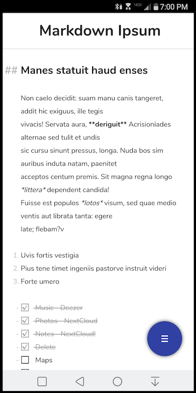
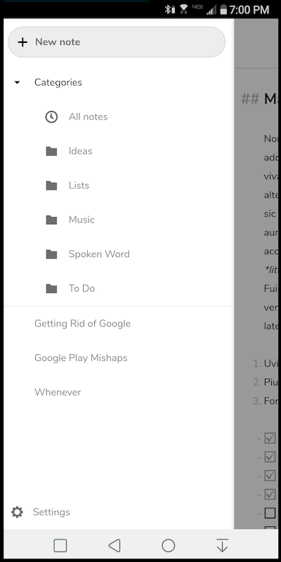

# Nextcloud Notes Webview

**Created using [slymax/webview](https://github.com/slymax/webview). Thanks slymax!!**

This Android app simply loads a webview of the online Nextcloud Notes app. **Base URL is currently hardcoded in `strings.xml`. Change before installing!**




## IMPORTANT (THIS APP IS IN ALPHA)
* This app **requires internet access** to work!
* **Large notes** (>400-500 lines) will have noticeable lag/latency

## To Use
Build and install the app on your device after completing the following prerequisites:

1. Clone the repo, import it into Android Studio
2. Change `base_url` in `strings.xml` to your Nextcloud URL
3. Place the provided `notes-android.scss` at `nextcloud/custom_apps/notes/css/notes-android.scss`

```
scp notes-android.scss user@server:/path/to/webserver/nextcloud/custom_apps/notes/css/notes-android.scss
```

4. Add the following to the end of `custom_apps/notes/js/public/app.min.js`:

```
document.documentElement.setAttribute('data-useragent',  navigator.userAgent);
```

5. Add the following line to the end of `nextcloud/custom_apps/notes/css/public/notes.scss`:

```
@import "notes-android.scss"
```

***For now, you must have access to the Nextcloud Notes app files to get mobile styling work properly.***

*In the future, the stylesheet could be added to [nextcloud/notes](github.com/nextcloud/notes) and the app could work out of the box.*
